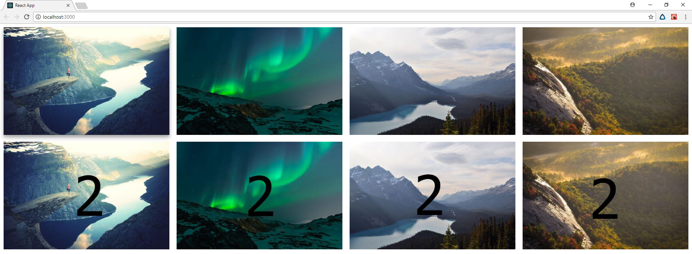
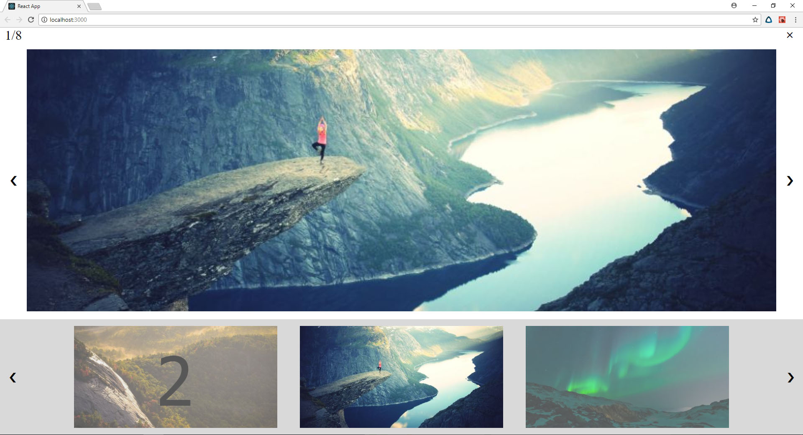
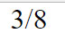

# What is this
this is the lightbox wrote on react

after the start you will see clickable images

# How to use
after clicking by one of this images you will see this:

this is calls modal


the text 1/8 shows selected picture number and quantity of all pictures,
the &times; is the button to close modal,
the big picture in center is the picture you selected before,
the &#10094; moves selected picture for a one back,
the &#10095; moves selected picture for a one forward,
the little pictures below the big one is bar, the picture in the center which have
opacity 1 is picture that is selected now, you can select another pictures in the bar
by clicking it,
the lower &#10094; moves bar pictures for a three back,
the lover &#10095; moves bar pictures for a three forward.

to add picture prepare small and big files than put files in src/
than open index.js and
write this in the bottom of the file
```javascript
import fileName from "./filePath.jpg";
import fileName_wide from "./filePath_wide.jpg";
```
than find FILES array and 1 element for each picture
add text prop and id prop so every next element would be like id: source1, id: source2, id: source3, or text: 1, text: 2, text: 3,
id prop needs to define pictures, and text id needs to write each picture number,
like this 
```javascript
const FILES = [

	{
		imagePath: fileName_wide,
		thumbnailPath: fileName,
		id: 'source1',
		text: '1'
	},
```
